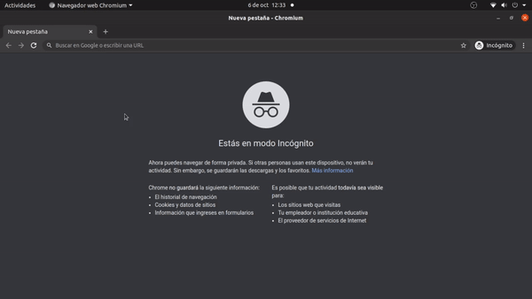

# Facebook login demo with Flask

You can learn Flask OAuth 2.0 client with this demo.



1. Creation of virtual environment

```bash
virtualenv venv
source ./venv/bin/activate
```

2. Installation of dependencies

```
pip3 install Authlib Flask requests
```

2. Get credential of Facebook

   Create your Facebook OAuth Client at https://developers.facebook.com/

3. Run server

```bash

python3 app.py

```

Then visit:

```bash
http://127.0.0.1:4000/login
```

4. Structure of Facebook Profile

```json
{
  id: "",
  name: "",
  email: "",
  picture: {
    data: {
      url: "",
    },
  },
};

```