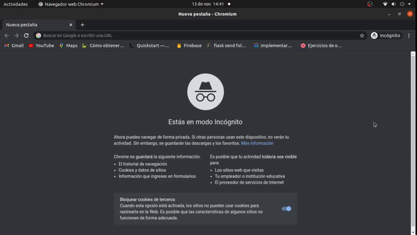

# Github login demo with Flask

You can learn Flask OAuth 2.0 client with this demo.



1. Creation of virtual environment

```bash
virtualenv venv
source ./venv/bin/activate
```

2. Installation of dependencies

```
pip3 install Authlib Flask requests
```

2. Get credential of Github

   Create your Github OAuth Client at https://github.com/settings/developers

3. Run server

```bash
python3 app.py
```

Then visit:

```bash
http://127.0.0.1:5000/login
```
